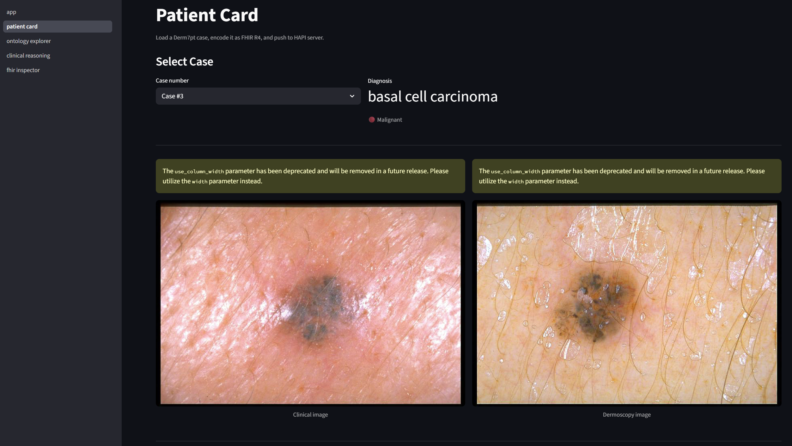
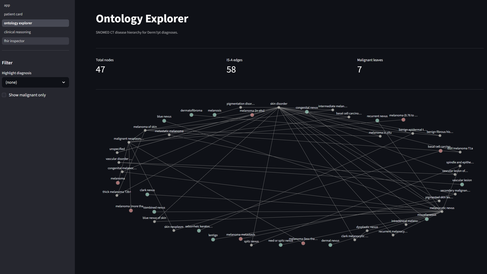
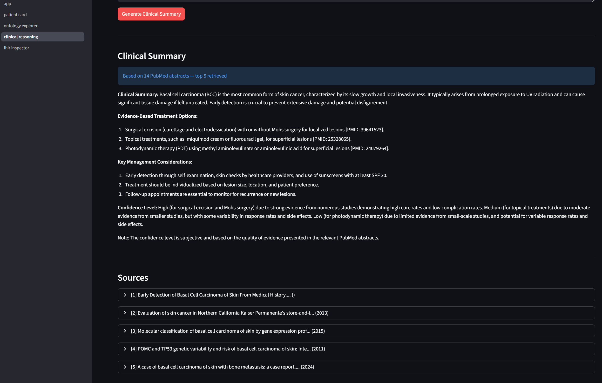
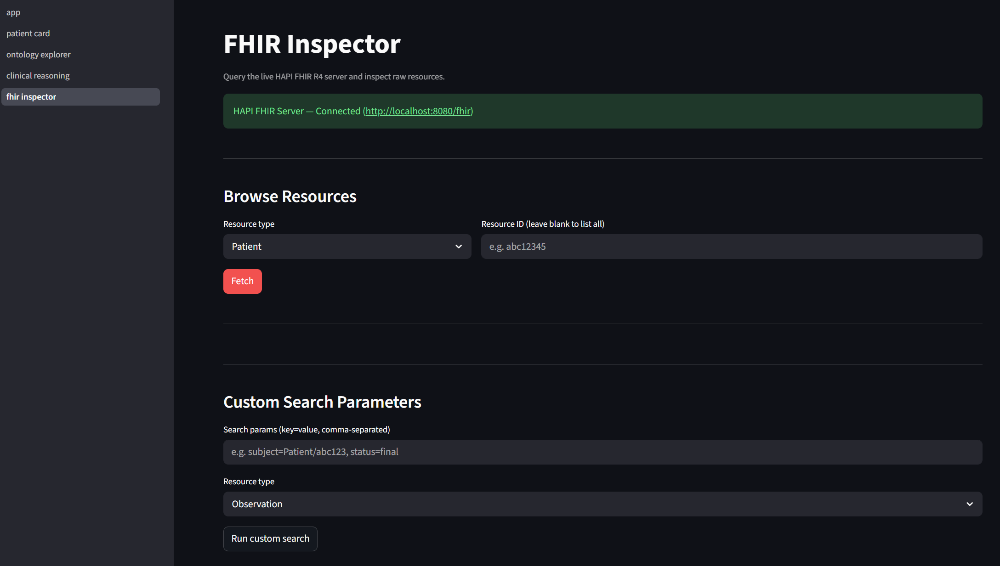
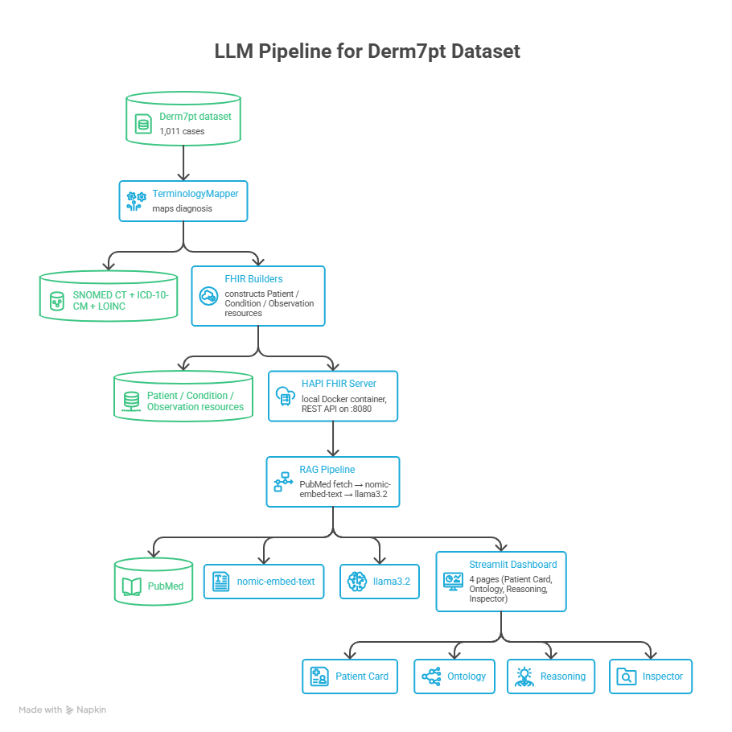
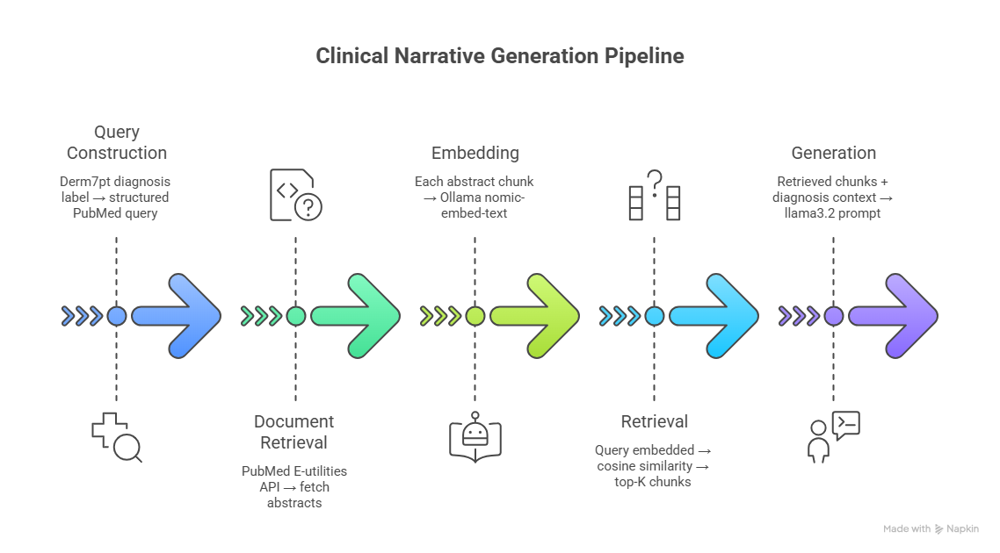

# DermIQ : Dermatology Clinical Decision Support

> FHIR R4 · SNOMED CT · ICD-10 · LOINC · RAG · Ollama

A portfolio project demonstrating production-grade health informatics skills:
- **Data modeling** with HL7 FHIR R4 (HAPI server)
- **Medical ontologies** (SNOMED CT, ICD-10-CM, LOINC)
- **Computational reasoning** via RAG (PubMed + Ollama llama3.2)
- **Clinical decision support** on the Derm7pt dermoscopy dataset

---

## Screenshots

### Patient Card
> Load a Derm7pt case, build FHIR resources, and push to the local HAPI server in one click.



---

### Ontology Explorer
> Interactive SNOMED CT hierarchy graph — navigate diagnosis relationships with Plotly.



---

### Clinical Reasoning (RAG)
> PubMed-grounded treatment suggestions generated by llama3.2 via a full RAG pipeline.



---

### FHIR Inspector
> Browse raw FHIR R4 JSON for any resource persisted to the HAPI server.



---

## Architecture

The system is built as a linear pipeline from raw dermoscopy data to clinical narrative:



Each layer is independently testable and replaceable. The FHIR server acts as the
single source of truth — all downstream components query it via REST, exactly as
they would in a real clinical integration.
git re3s
### Why this architecture?

**Separation of concerns.** Terminology mapping, FHIR construction, and clinical
reasoning are three different domains of expertise and three different failure modes.
Keeping them as discrete modules makes the system easier to audit, extend, and explain
to a clinical stakeholder who cares about data provenance.

**Local-first.** Every component (HAPI, Ollama, embeddings) runs locally with no
external API calls. This makes the demo fully reproducible and keeps patient-like
data off third-party infrastructure — a non-negotiable in any real clinical context.

---

## RAG Pipeline — Deep Dive

The RAG pipeline in `core/rag/` is the most technically interesting component.
Here is how it works end-to-end:



**Why `nomic-embed-text`?**
At 768 dimensions it produces embeddings of comparable quality to OpenAI's
`text-embedding-3-small` for medical text, with zero API cost and no network
dependency. PubMed abstracts are short enough that a simple numpy cosine search
outperforms a full vector database at this dataset size.

**Why no LangChain?**
LangChain abstractions obscure the retrieval logic and add significant dependency
weight. The pipeline here is ~150 lines of plain Python — every step is visible
and debuggable, which is the right property for a portfolio project and for any
system that will be explained to a clinical team.

---

## Medical Standards

| Standard | Role in project |
|---|---|
| **HL7 FHIR R4** | Data interchange format — all resources are valid FHIR R4 |
| **SNOMED CT** | Primary clinical coding of diagnoses |
| **ICD-10-CM** | Secondary coding for billing / epidemiological statistics |
| **LOINC** | Coding of dermoscopy observations |

### LOINC gap for dermoscopy observations

Dermoscopy-specific features (pigment network, streaks, regression structures, etc.)
lack dedicated LOINC codes. This project uses `LOINC 44652-2` ("Dermatology study")
as a base code and carries specificity in `Observation.code.text`. This is a standard
real-world pattern for terminology gaps — it keeps resources FHIR-valid while
preserving the clinical detail that a LOINC committee has not yet standardised.

---

## Design Decisions

### Why local HAPI over a public FHIR sandbox?

Full infrastructure ownership. A local Docker container produces stable, reproducible
demos that do not depend on the availability or rate-limits of a shared sandbox. It
also demonstrates containerization skills — HAPI FHIR is a non-trivial service to
stand up correctly.

### Why Ollama over OpenAI?

Zero external dependencies, fully reproducible, no API cost, and data stays local.
`nomic-embed-text` is well-suited for medical text similarity. For a project that
handles patient-like data, keeping inference local is also the ethically cleaner choice.

### Why manual `terminology_map.json` over automated lookup?

For 20 diagnoses, manual curation with source citations is more defensible than
automated mapping. It demonstrates understanding of the standards themselves, not
just their APIs. Each entry in the map is traceable to a specific SNOMED CT, ICD-10,
and LOINC release — something an automated pipeline cannot guarantee without
additional validation infrastructure.

### Why Pydantic v2?

Used in two places with distinct purposes:

- **`core/fhir/schemas.py`** — validates FHIR resource structure *before* sending to
  HAPI. Catches missing required fields at construction time, not at HTTP-error time.
- **`core/ontology/mapper.py`** — validates every entry in `terminology_map.json` at
  startup. A malformed terminology entry fails loudly on load, not silently mid-request.

---

## Setup

### 1. Start HAPI FHIR Server

```bash
cd docker
docker-compose up -d
# Wait ~60s, then verify: http://localhost:8080/fhir/metadata
```

### 2. Pull Ollama models

```bash
ollama pull llama3.2
ollama pull nomic-embed-text
```

### 3. Install Python dependencies

```bash
pip install -r requirements.txt
```

### 4. Add Derm7pt data

Place the Derm7pt dataset in `data/derm7pt/`:

```
data/derm7pt/
├── meta.csv
└── images/   (dermoscopy images — optional for this demo)
```

### 5. Run the app

```bash
streamlit run app.py
```

---

## Project Structure

```
dermiq/
├── docker/
│   └── docker-compose.yml       # HAPI FHIR R4 server
├── data/
│   ├── terminology_map.json     # SNOMED + ICD-10 + LOINC verified codes
│   └── derm7pt/meta.csv
├── core/
│   ├── fhir/
│   │   ├── client.py            # HAPI REST wrapper + retry logic
│   │   ├── builders.py          # Derm7pt row → FHIR resources
│   │   └── schemas.py           # Pydantic v2 FHIR models
│   ├── ontology/
│   │   ├── mapper.py            # Terminology lookup + Pydantic validation
│   │   └── graph.py             # networkx SNOMED hierarchy
│   └── rag/
│       ├── pubmed.py            # PubMed E-utilities fetcher
│       ├── embedder.py          # Ollama nomic-embed-text
│       └── retriever.py         # Full RAG pipeline → llama3.2
├── pages/
│   ├── 1_patient_card.py        # Load case → build → push to FHIR
│   ├── 2_ontology_explorer.py   # Interactive SNOMED graph (Plotly)
│   ├── 3_clinical_reasoning.py  # RAG treatment suggestions
│   └── 4_fhir_inspector.py      # Raw FHIR JSON browser
├── app.py                       # Streamlit entry point
├── config.py                    # All constants and env vars
└── requirements.txt
```

---

## License

MIT
